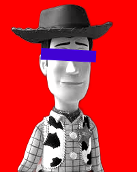

# install library rembg, onnxruntime and pillow

```bash
pip install pillow rembg onnxruntime
```
# use the function

```python
profile_sdm_tinggi('input.jpg', 'output.jpg', 'red', 0.450, 0.02, 0.2, 60, 'black')
```
you can adjust the line positions by change the number ratio 0.450(eye position), 0.02(line height), 0.2(line width), 60(for left and right positions).
remember to delete the existing input.jpg and change with your picture

## Preview
